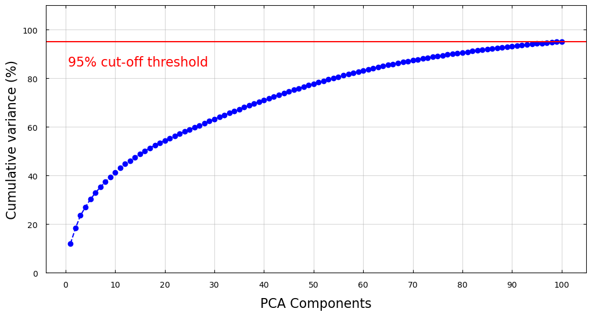

# AMEX Default Prediction
Group 37: _Hassan Naveed, Aditi Prakash, Emma Dang, Amritpal Singh_

## Introduction/Background
With credit-based spending dominating modern consumer behavior and 70% of Americans using a credit card regularly for payments [5], it is critical for credit issuers to assess the risk of their practice to minimize the impact of credit defaulting and ensure greater sustainability of borrowing and lending in the long term. Manual assessment of financial statements and direct calculation of default probability with models like the Merton model is widely leveraged today by lenders. However, these methods are often too generic to capture credit risk at the correct level of granularity and make oversimplifying assumptions that lead to error during risk assessment. 

## Problem Definition
Decision trees, clustering models, and logistical regression are used today to predict credit defaulting based on data that maps consumer demographic and spending data to the credit risk of lending. These models rely on an unmanageably large variety of features and could continue to improve in accuracy. Our AMEX dataset contains features describing spending, payment, balance, and risk-informative measures for AMEX customers across a sample 18-month period, and the target variable is the probability of the customer's most recent credit card statement being defaulted. The goal of this project is to further explore machine learning techniques for more accurate credit default risk prediction based on a relatively small but effective feature set.

## Data Collection and Preprocessing
### Data Collection
We obtain the data set from the [AMEX Default Prediction](https://www.kaggle.com/competitions/amex-default-prediction/overview) competition on Kaggle. According to the official competition site, the data contains profile features for each customer at the statement date. All features have been anonymized, normalized, and fall into these categories:
- D_*: Delinquency features
- S_*: Spend features
- P_*: Payment features
- B_*: Balance features
- R_*: Risk features

The training data contains a total of 190 features and contains 3 types of variables: `float` (185 features), `int` (1 feature), `string` (4 features). There are 5,531,450 data points. An initial observation reveals that __*120/190*__ features contain NaN values. Approximately 75% of the features have less than 10% NaN values. Some features like D_87 and B_39 are heavy in NaN values, with more than 90% of the data points being NaN. An initial reaction would be to discard features like D_87 which has 99.93% NaN values; however, 0.07% of the data points is roughly 4,000 data points. We need to perform some data preprocessing to predict the values of these NaN values.

The training labels are binary: 1 means __Default__ while 0 means __Compliance__. There are a total of 458,913 labels, each of which corresponds to an unique customer ID. There is no NaN values in the labels.

### Comparing Train and Test distributions

#### Difference in Variance between Train and Test data
(Columns with difference bigger than 0.5 threshold)

|Column  |  train_data  | test_data|
| :---:        |    :----:   |         :---:   |
|B_10   | 4.892 |  11.797|
|D_69   | 23.244  |40.610|
|R_7    | 3.031 |  2.415|
|B_26   | 2.915  | 6.453|
|R_14   | 28.336 | 31.363|

#### Difference in Skewness between Train and Test data
(Columns with difference bigger than 30 threshold)

| Column   | train_data |   test_data |
| :---:        |    :----:   |         :---:   |
| D_49    | 3.514       | 60.036 | 
| B_6         | 93.541     |  48.117 | 
| B_10      |   77.712     |  163.682 |
| S_12       |  165.302      |    16.579 |
| D_69       |  83.585     |  144.859 |
| D_71       |  95.553     |  51.730 |
| B_26       |  57.634     |  100.810 |
| D_83       |  16.959     |  80.116 |
| R_23      |   59.143      | 0.011 |
| S_26       |  24.246     |  79.113 |
| B_40       |  45.920      | 169.337 |

### Data Preprocessing
1. Encode categorical features.  
We use an ordinal encoder to encode categorical features because deliquency variables tend to follow a logical ordering. The following table summarizes information about categorical features

| Feature      | Description | Value Range     | Encoder
| :---:        |    :----:   |         :---:   | :---:
| `customer_ID`| customer ID  | 458,913 unique ID  | NA[*](#myfootnote1)
| `S_2` | Statement date  | Various datetime values   | ΝΑ[*](#myfootnote1)
| `D_63` | Deliquency variable  | `['CR', 'CO', 'CL', 'XZ', 'XM', 'XL']` | Οrdinal 
| `D_64` | Deliquency variable  | `['O', 'R', nan, 'U', '-1']` | Ordinal

<a name="myfootnote1">*</a> This feature is not encoded because their data are not used in training models.

2. Predict missing values.  
Each customer ID has several data points. Each missing value is replaced with the mean of the __feature__ data grouped by customer ID.

3. Customized preprocessing steps.  
Different types of learning required specialized preprocessing pipeline. For each training model, we will build a custom preprocessing pipeline optimized for that model.
- KMeans: we first normalize the data along each feature, then use the _Principle Component Analysis (PCA)_ to compress the feature space while preserving 95% of the variance in the data. 
- GMM: we use the normalized PCA data described in the Kmeans preprocessing section above and separate it into an 80-20 train-test split in order to compute internal and external metrics on the train split and visualize the performance of GMM on the test split. 
> __*TO DO*__: fill in the preprocessing for the gradient boosting method.

## Data Visualization    
Data visualization is an important step in machine learning. With a good visualization, we can discover trends and patterns in the data. In this section, we attempt to visualize the AMEX dataset. We first reduce the feature space of our data by using _Principle Component Analysis (PCA)_ and _t-distributed stochastic neighbor embedding (t-SNE)_. Then we show the graph of the data set projected on several components that preserve the most amount of variance. We hope to obtain some insights about the AMEX dataset and use the knowledge to guide our model selection and training.

### PCA
PCA identifies the combination of attributes, or principle components in the feature space, that explains the most variance in the data. Here, we plot the cumulative variance explained by the principle components of the AMEX dataset. To capture 95% of the variance, we need at least 100 components. 

*Figure 1: Cumulative variances of PCA components.*

The figure below shows the scatter plot of the training dataset projected onto three PCA components that capture the most variance. The turquoise marker represents the data points that belong to the compliance class. The dark orange marker represents the data points that belong to the default class. The below 3D animation plot shows a large overlap between the compliance class and the default class, demonstrating the challenge of the classification task.

*Figure 2: Training Data Projection on three PCA Components with the Highest Variance.*

The next figure shows the data projected onto every pair of the first seven PCA components. Similar to the previous graph, the turquoise color represents the compliance-class data, while the dark orange color represents the default-class data. In the figure, no combination of two features offers a perfect separation of the two classes. In the pair of PCA components that give the best separation, such as (PCA 1, PCA 5), the two class data still shows a considerate amount of overlap. In addition, the separation is non-linear, suggesting that a parametric model such as GMM and supervised learning methods are the most suitable to learn the data. 

*Figure 3: Training Data Projection on seven PCA Components with the Highest Variance.*

### t-SNE

*Figure 4: Training Data Projection on two tSNE Components.*

*Figure 5: Training Data Projection on three tSNE Components*

> __*TO DO:*__: some analysis of the tSNE results?

## Methods:
### Unsupervised
The role of unsupervised learning will be to understand the hidden data structures for better feature processing. 
-  Clustering algorithms: visualize the data to allow better feature processing.
-  Dimensionality reduction (PCA, tSNE and UMAP): Given a total of 190+ features, methods like tSNE and PCA can help visualize the data points and choose relevant features. Reduced feature count could also help boost training speed for supervised methods.

#### KMEANS
Kmeans algorithm separates data into n clusters that minimizes the distance between the data points and the cluster centroids. Because our problem is a binary classification, we use Kmeans to divide the data into two clusters and classify each cluster based on the majority of the votes of the k-nearest neighbors. 

The preprocessing pipeline for KMEANs consists of 1) the general preprocessing where the missing values are populated with the mean of each feature grouped by customer ID, 2) data normalization along the features, 3) dimensionality reduction with PCA that captures 95% of the variance in the data.

#### GMM
Our data may not be spherically clustered, so it is beneficial to also run GMM to obtain soft clusterings for our data points and derive the pdfs for the Gaussian components our data distribution resembles in the process. Since GMM optimizes for both the mean and covariance of each Gaussian component, and it is likely that covariance impacts the distribution of our data, we run GMM with 2 components to obtain Gaussian pdfs that represent the two classes in our problem (compliance and default). 

The preprocessing pipeline for GMM consists of 1) the general preprocessing where the missing values are populated with the mean of each feature grouped by customer ID, 2) data normalization along the features, 3) dimensionality reduction with PCA that captures 95% of the variance in the data, 4) holding out 20% of the dataset for visualization of the GMM model's performance on unseen data. 

We fit 5 GMM models to the train dataset, each of which ingests an increasingly large subspace of the feature sapce (the first 10, 30, 50, 70, and 90 PCA features, respectively). These features account for roughly 40%, 60%, 80%, 85%, and 95% of the variance in the original train data, respectively. We also train a GMM model on all of the PCA features for comparison to these first 5 models. 

### Supervised
This is primarily a Supervised Learning problem that requires binary classification. Currently, due to the large size of the dataset, 10,000 customers were used with 80% used for training and 20% for validation. Gradient Boosted trees and Neural Networks have shown promise in this domain [1,3].
####	Gradient Boosting (GB):  
Boosted trees (available through sklearn) have had a great performance in credit risk modeling. However, since trees cannot make use of temporal information, the features would need to be aggregated at customer level. The current approach used the both the mean and medians of the feature values across time for each customer. So if `D_64` was a feature in the dataset, now we have the mean of D_4 for that customer as well as the median. We hope to try other aggregations of the features as well such as min, max or just the last value. Any missing values after this aggregation (when all entries for that customer and feature combination were missing) were replaced with zeros. We also tried replacing missing values with the mean, but the result was not that different. The results are shown in the [next section](https://github.com/ehhdang/AMEX-Default-Prediction#supervised-learning).

#### Neural Networks: 
A similar approach can be followed with Feed-forward networks. The temporal nature of the data makes it suitable for Long Short Term Memory (LSTM) networks, and the fixed number of periodicity might permit the use of transformers.

We not only hope to compare these approaches, but also ensemble them together to get our best performing model.

## Results and Discussion
### Evaluation Metrics
We want to recreate the evaluation metric from the competition: https://www.kaggle.com/competitions/amex-default-prediction/overview/evaluation

1. Unsupervised methods:  
We use both internal metrics (e.g. Beta-CV, Davies-Bouldin, and Silhouette score) and external metrics (e.g. purity, precision, recall, accuracy) to evaluate our clustering models.  
- A good clustering result minimizes the distance between intra-cluster data points while maximizing the distance between inter-cluster data points. Beta-CV is a graph-based metrics that computes the ratio of the mean intra-cluster distance to the mean inter-cluster distance. The smaller the Beta-CV score is, the bettter the cluster result is. Silhouette coefficient measures the relative distance from the closest outer cluster to the average intra-cluster distance. A silhouette coefficient close to 1 implies a good cluster because the intra-cluster points are close to one another but far away from other clusters. A coefficient close to -1 indicates that a sample has been assigned to a wrong cluster as a closer cluster is found. A coefficient around 0 indicates overlapping between clusters. Davies-Bouldin index measures how compact the clusters are compared to the distance between the cluster means. A lower Davies_Bouldin index means a better clustering result.  
- Because we have access to the ground truths of our training data, we compute some external measures to further evaluate the performance of our clustering models. Purity quantifies the extent to which a cluster contains points from only one ground truth partition. A purity value close to 1 indicates a perfect clustering. In this project, we use maximum matching to avoid matching two clusters to the same partition or class. Purity is also known as precision, which measures the quality of our clusters, such as how precisely each cluster represents the ground truth. Another metrics is recall score, which computes how completely each cluster recovers the ground truths. We also report the F-measure, which is the harmonic mean of precision and recall. F-measure captures both the completeness and the precision of the clustering.

2. Unsupervised Methods:  
We introduce two terms to help us evaluate our supervised models:  
- Normalized Gini Coefficient (G). Here is was calculated from the AUC score using the formula
$$GINI = (2*AUC)-1 $$
- Default rate at 4% (D). This captures a Sensitivity/Recall statistic by calculating the portion of defaults in the highest-ranked 4% of predictions.  
Using **G** and **D** our evaluaton metric **M** is found by:
$$M = 0.5 \cdot(G+D) $$

### Unsupervised Learning

#### KMEANS
Our Kmeans model has a silhouette score of __0.23__, a Beta-CV value of __0.23__, and a Davies-Boulder index of __2.64__. The close-to-zero silhouette score indicates an overlap between the two clusters. The small Beta-CV score suggests that the data points within each cluster are close to one another compared to the distance between the cluster means. The PCA component visualization shows the non-linear separation between the two classes. Being a non-parametric clustering model, KMeans may lack the power to give a finer separation between compliance and default customers.

We do a more in-depth analysis of our Kmeans model by looking at several external metrics. The accuracy of the model is 85% on testing data. Nevertheless, the precision score differs greatly between two clusters. Our KMeans model is more precise in predicting compliance data point than predicting default data points. In the confusion matrix figure above, the default cluster has roughly a similar number of default data points as compliance data points. As a result, the default cluster has a low precision score of 0.69. On the other hand, the compliance cluster has a good precision score of 0.92. The Kmeans model predicts default class poorly, despite giving a good prediction of the compliance class. The table below summarizes other externals metrics on this Kmeans model. 

| External Metrics      | Compliance Cluster | Default Cluster     |
| :---:        |    :----:   |         :---:   |
| Precision Score| 0.92  | 0.69  |
| Recall Score |  0.88      | 0.77      |
| F-measure | 0.89       | 0.85      |
| Accurity Score | 0.85       | 0.85     |

#### GMM
The 5 GMM models we train initially converge after 14, 15, 30, 19, and 28 iterations, respectively. We visualize their performance below: 

Interestingly, the clustering decision appears to nearly swap for each sample in the second GMM model and then reverts to its original distribution in the third GMM model. This indicates that making the clustering decision with GMM using a small subset of the features may generate similar results as using a large subset, so it may not be necessary to keep all of the PCA features for our data modeling going forward. 

The GMM model we train on all of the PCA features converges after 21 iterations. We compare its predictions to the truth values for a sample of the train data below:

The silhouette score for the full-feature GMM model is 0.46, the Beta-CV score is 0.096, and the Davies-Bouldin index is 3.303. The decent silhouette score is likely due to the fact that we only ran GMM with 2 components, which may cause the points in each cluster to be closer to the other cluster than if we generated more Gaussian PDFs to describe the model (since the decision boundary is likely closer to any given data point than if there were more clusters). The Beta-CV score is very small, indicating the data within each cluster are close to one another. 

Below is the confusion matrix for the full-feature GMM model on the train split:

Cluster 0 has a purity of 0.78 and Cluster 1 has a purity of 0.72, generating a total purity of 0.78. This indicates that both clusters roughly correspond to 1 class each. 

| External Metrics      | Compliance Cluster | Default Cluster     |
| :---:        |    :----:   |         :---:   |
| Precision Score| 0.85  | 0.63  |
| Recall Score |  0.88      | 0.56      |
| F-measure | 0.86       | 0.60      |
| Accuracy Score | 0.80       | 0.80     |

The GMM model is 80% accurate for both clusters, and the Compliance cluster represents and recovers the ground truth data better than the Default cluster. This could be due to the fact that there are less samples with the default label than the compliance label in the training data. To address this, future work could entail generating more data that falls in the default class or clustering with more components so that each cluster more accurately represents a single class.

### Supervised Learning
After training an XGBoost classifier with 100 trees and max_depth of 3, we get the following metrics:

| Metrics      | XG Boost Score     |
| :---:        |    :---:   |
| Precision Score| 0.69 |
| Recall Score |  0.86  |
| F-measure | 0.89   |
| Accuracy Score | 0.86  |
| AUC Score | 0.9419 |
| GINI Score (G) | 0.8838 |
| Default rate at 4% (D) | 0.53|
|M | 0.71|

The metrics G, D and M are defined by the competion and are highlighted in the [previous section](https://github.com/ehhdang/AMEX-Default-Prediction#evaluation-metrics)

The confusion matrix with this sample in the validation set is shown below:

Below is a visual depiction of the AUC curve, which takes into account the false positive and false negative rates at various thresholds:

The red line demoonstrates the default rate at 4%, which is a required metric for this data. Here it could use some improvement. Even then, a simpled untuned xgboost will be a difficult baseline to outperform for more advanced models:

In the Kaggle competition, the best-performing models achieve scores of 0.80 in this metric, and we hope to achieve accuracy close to that. However, we will face some difficulties because the test data is not merely a random sample of the training data. The test data covers not only a separate set of customers, but also a different time period.

Our initial results show the M score around 0.71 in the validation set and we hope this score will be reflected in the test set as well. This will need to be improved to reach state of the art performance.

## References
1. [Machine Learning: Challenges, Lessons, and Opportunities in Credit Risk Modelling](https://www.moodysanalytics.com/risk-perspectives-magazine/managing-disruption/spotlight/machine-learning-challenges-lessons-and-opportunities-in-credit-risk-modeling) 
1. [Credit Risk Modeling with Machine Learning](https://towardsdatascience.com/credit-risk-modeling-with-machine-learning-8c8a2657b4c4)
1. [Modelling customers credit card behaviour using bidirectional LSTM neural networks](https://journalofbigdata.springeropen.com/articles/10.1186/s40537-021-00461-7)
1. [Research on Credit Card Default Prediction Based on k-Means SMOTE and BP Neural Network](https://www.hindawi.com/journals/complexity/2021/6618841/)
1. [Percent people with credit cards - Country rankings](https://www.theglobaleconomy.com/rankings/people_with_credit_cards/)

## Proposed Timeline
The project's timeline and task breakdown are detailed in this [Gantt chart](https://docs.google.com/spreadsheets/d/1NwSPawBI_k9x3xHloXmnbROMbCaqwuFalB0XVgNrCJ8/edit?usp=sharing).

## Contribution Table for the Midterm Report
 - Hassan Naveed: Method, Result and Discussion for the Gradient Boosting model.
 - Aditi Prakash: Method, Result and Discussion for the GMM model.
 - Emma Dang: Data Preprocessing, Method, Result, and Discussion for KMEANS model.
 - Amritpal Singh: Data Cleaning and Preprocessing, PCA and tSNE models.
