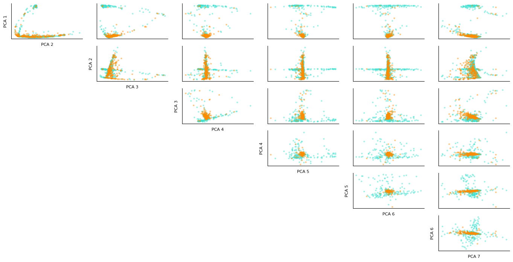

# AMEX Default Prediction
Group 37: _Hassan Naveed, Aditi Prakash, Emma Dang, Amritpal Singh_

## Introduction/Background
With credit-based spending dominating modern consumer behavior and 70% of Americans using a credit card regularly for payments [5], it is critical for credit issuers to assess the risk of their practice to minimize the impact of credit defaulting and ensure greater sustainability of borrowing and lending in the long term. Manual assessment of financial statements and direct calculation of default probability with models like the Merton model is widely leveraged today by lenders. However, these methods are often too generic to capture credit risk at the correct level of granularity and make oversimplifying assumptions that lead to error during risk assessment. 

## Problem Definition
Decision trees, clustering models, and logistical regression are used today to predict credit defaulting based on data that maps consumer demographic and spending data to the credit risk of lending. These models rely on an unmanageably large variety of features and could continue to improve in accuracy. Our AMEX dataset contains features describing spending, payment, balance, and risk-informative measures for AMEX customers across a sample 18-month period, and the target variable is the probability of the customer's most recent credit card statement being defaulted. The goal of this project is to further explore machine learning techniques for more accurate credit default risk prediction based on a relatively small but effective feature set.

## Data Collection and Preprocessing
### Data Collection
We obtain the data set from the [AMEX Default Prediction](https://www.kaggle.com/competitions/amex-default-prediction/overview) competition on Kaggle. According to the official competition site, the data contains profile features for each customer at the statement date. All features have been anonymized, normalized, and fall into these categories:
- D_*: Delinquency features
- S_*: Spend features
- P_*: Payment features
- B_*: Balance features
- R_*: Risk features

The training data contains a total of 190 features and contains 3 types of variables: `float` (185 features), `int` (1 feature), `string` (4 features). There are 5,531,450 data points. An initial observation reveals that __*120/190*__ features contain NaN values. Approximately 75% of the features have less than 10% NaN values. Some features like D_87 and B_39 are heavy in NaN values, with more than 90% of the data points being NaN. An initial reaction would be to discard features like D_87 which has 99.93 NaN values; however, 0.07% of the data points is roughly 4,000 data points. Without any doubt, we need to perform some data preprocessing to predict the values of these NaN values.

The training labels are binary: 1 means default while 0 means otherwise. There are a total of 458,913 labels, each of which corresponds to an unique customer ID. There is no NaN values in the labels.

### Comparing Train and Test distributions

#### Difference in Variance between Train and Test data
(Columns with difference bigger than 0.5 threshold)

|Column  |  train_data  | test_data|
| :---:        |    :----:   |         :---:   |
|B_10   | 4.892 |  11.797|
|D_69   | 23.244  |40.610|
|R_7    | 3.031 |  2.415|
|B_26   | 2.915  | 6.453|
|R_14   | 28.336 | 31.363|

#### Difference in Skewness between Train and Test data
(Columns with difference bigger than 30 threshold)

| Column   | train_data |   test_data |
| :---:        |    :----:   |         :---:   |
| D_49    | 3.514       | 60.036 | 
| B_6         | 93.541     |  48.117 | 
| B_10      |   77.712     |  163.682 |
| S_12       |  165.302      |    16.579 |
| D_69       |  83.585     |  144.859 |
| D_71       |  95.553     |  51.730 |
| B_26       |  57.634     |  100.810 |
| D_83       |  16.959     |  80.116 |
| R_23      |   59.143      | 0.011 |
| S_26       |  24.246     |  79.113 |
| B_40       |  45.920      | 169.337 |

### Data Preprocessing
1. Encode categorical features.

| Feature      | Description | Value Range     |
| :---:        |    :----:   |         :---:   |
| `customer_ID`| customer ID  | 458,913 unique ID  |
| `S_2` | Statement date       | Various datetime values      |
| `D_63` | Deliquency variable       | `['CR', 'CO', 'CL', 'XZ', 'XM', 'XL']`      |
| `D_64` | Deliquency variable       | `['O', 'R', nan, 'U', '-1']`      |

We use an ordinal encoder to encode `D_63` and `D_64` features because deliquency variables tend to follow a logical ordering.

2. Predict missing values.  
For each feature, we replace missing data with the mean of the complete data that has a matching label.

3. Normalize data.
Next, we normalize the data so that it has the range between 0 and 1. 

## Data Visualization    
Data visualization is an important step in machine learning. With a good visualization, we can discover trends, patterns, insights into the data. In this section, we attempt to visualize the AMEX dataset. This is a challenging task because of the large number of features. To ease this task, we reduce the dimensionality of the data by using _Principle Component Analysis (PCA)_. 

PCA identifies the combination of attributes, or principle components in the feature space, that explains the most variance in the data. Here, we plot the cumulative variance explained by the principle components of the AMEX dataset. To capture 95% of the variance, we need at least 43 components. 

*Figure 1: Cumulative variances of PCA components.*

The figure below shows the scatter plot of the training dataset projected onto three PCA components that capture the most variance. The data corresponding to the compliance class is mapped to a turquoise color, while the data corresponding to the default class is mapped to a dark orange color. There is a large overlap between the compliance class and the default class, showing the challenge of the classification task.

*Figure 2: Training Data Projection on three PCA Components with the Highest Variance.*

The next figure shows the relationship between the first seven PCA components. The turquoise color represents the compliance-class data, and the dark orange color represents the default-class data. According to the figure, no combination of two features offers a good separation of the two classes. The large amount of overlap suggests that the regression model to separate the two class will be highly nonlinear.

*Figure 3: Training Data Projection on seven PCA Components with the Highest Variance.*

### PCA and t-SNE results

*Figure 4: Training Data Projection on two PCA Components*

*Figure 4: Training Data Projection on three PCA Components*

*Figure 4: Training Data Projection on two tSNE Components.*

*Figure 4: Training Data Projection on three tSNE Components*

## Methods:
### Unsupervised
The role of unsupervised learning will be to understand the hidden data structures for better feature processing. 
1) Clustering algorithms: visualize the data to allow better feature processing.
2) Dimensionality reduction (PCA, tSNE and UMAP): Given a total of 190+ features, methods like tSNE and PCA can help visualize the data points and choose relevant features. Reduced feature count could also help boost training speed for supervised methods.

#### KMeans
The Kmeans algorithm separates data into n clusters that minimizes the distance between the data points and the cluster centroids. Because our problem is a binary classification, we use Kmeans to divide our post-PCA processed data into two clusters and classify each cluster based on the majority of the votes of the k-nearest neighbors. Our Kmeans model has a silhouette score of __0.188__, which indicates a large overlap of the two clusters. Being a non-parametric clustering algorithm, Kmeans is not powerful enough to handle the non-linear separation of our data classes. 

We do a more in-depth analysis of our Kmeans model by looking at several external metrics. The accuracy of the model is 76.52% on testing data. This low accuracy comes from the model's inability to precisely predict default customers. In the confusion matrix figure below, the default cluster has roughly the same number of default data points as compliant data point. As a result, the default cluster has a low precision score of 0.52. On the other hand, the compliance cluster has a good precision score of 0.91. The Kmeans model predicts default class poorly and thus should not be a predictive model of our problem, despite giving a good prediction of the compliance class. The table below summarizes other externals metrics on this Kmeans model. 

| Metrics      | Compliance Cluster | Default Cluster     |
| :---:        |    :----:   |         :---:   |
| Precision Score| 0.911  | 0.52  |
| Recall Score |  0.76      | 0.77      |
| F-measure | 0.83       | 0.62      |
| Accurity Score | 0.76       | 0.76      |

### Supervised
This is primarily a Supervised Learning problem that requires binary classification. The models which have shown promise with previous work [1,3] are:
1)	Gradient Boosting (GB): Boosted trees (available through sklearn) have had a great performance in credit risk modeling. However, since trees cannot make use of temporal information, the features would need to be aggregated at customer level.
2)	Neural Networks: A similar approach as (1) can experiment with Feed-forward networks. The temporal nature of the data makes it suitable for Long Short Term Memory (LSTM) networks, and the fixed number of periodicity might permit the use of transformers.

We not only hope to compare these approaches, but also ensemble them together to get our best performing model.

## Results & Discussion
The models would be tested according to the competition metric. This consists of the average of:
-	Normalized Gini Coefficient (G)
-	Default rate at 4% (D). This captures a Sensitivity/Recall statistic by calculating the portion of defaults in the highest-ranked 4% of predictions

The best-performing models achieve scores of 0.80 in this metric, and we hope to achieve accuracy close to that. In addition, models would also be compared using common binary classification metrics such as AUC, Accuracy, Precision, etc.

## References
1. [Machine Learning: Challenges, Lessons, and Opportunities in Credit Risk Modelling](https://www.moodysanalytics.com/risk-perspectives-magazine/managing-disruption/spotlight/machine-learning-challenges-lessons-and-opportunities-in-credit-risk-modeling) 
1. [Credit Risk Modeling with Machine Learning](https://towardsdatascience.com/credit-risk-modeling-with-machine-learning-8c8a2657b4c4)
1. [Modelling customers credit card behaviour using bidirectional LSTM neural networks](https://journalofbigdata.springeropen.com/articles/10.1186/s40537-021-00461-7)
1. [Research on Credit Card Default Prediction Based on k-Means SMOTE and BP Neural Network](https://www.hindawi.com/journals/complexity/2021/6618841/)
1. [Percent people with credit cards - Country rankings](https://www.theglobaleconomy.com/rankings/people_with_credit_cards/)

## Proposed Timeline
The project's timeline and task breakdown are detailed in this [Gantt chart](https://docs.google.com/spreadsheets/d/1NwSPawBI_k9x3xHloXmnbROMbCaqwuFalB0XVgNrCJ8/edit?usp=sharing).

## Contribution Table for Project Proposal
 - Hassan Naveed: Methods, Result, and Discussion for the supervised portion.
 - Aditi Prakash: Introduction, Background, and Problem Definition.
 - Emma Dang: GitHub Pages, Proposed Timeline, and Contribution Table.
 - Amritpal Singh: Method, Result, and Discussion for the unsupervised portion.
